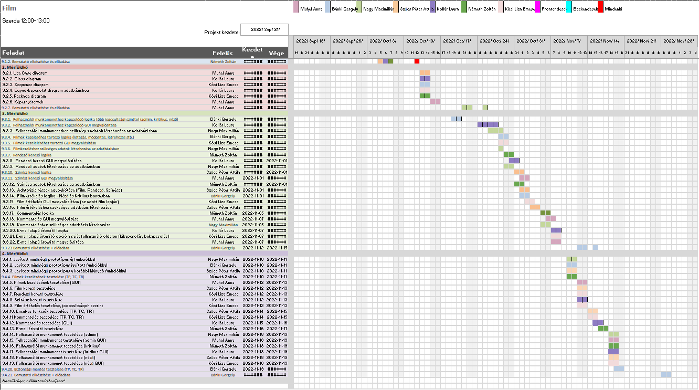

# Film Review Projektterv 2022

## 1. Összefoglaló 

Egy film milliónyi szót tud egyetlen pillanattal mutatni, és természetéből adódóan elsősorban látványvilágával mutatja meg magát, legyen az kápráztató, sivár vagy esetleg csak szürke. Ahhoz, hogy megtaláljuk kedvenc filmünket, vagy esetleg hasonlókat hozzá, szükség van egy olyan platformra, amely részletes leírást tartalmaz sokfajta filmről. Projektünk célja ennek megvalósítása, egy olyan könnyen elérhető és -használható oldalt építeni, amely folyamatosan bővülő filmgyűjteményével segít a felhasználónak megtalálni a tökéletes filmet.

```
Ide írd le tömören (4-6 mondatban), hogy miről szól a projekt, amit a gyakorlatvezetőtől kaptatok. 
Írd le, hogy mik a fő célok, miért van a weboldalra szükség. 
A dokumentumban a pirossal illetve a blokkokkal kiemelt szövegeknek két jelentése van: 
(a) minta/sablon szöveg, amit le kell cserélni, pl. gyakorlatvezető neve; 
(b) segítő/magyarázó szöveg. 
Az átadott dokumentumban nem szerepelhetnek se pirossal kiemelt, se blokkban szereplő részek! A
feketével írt részek törlése tilos, azok közösek.
```

## 2. Verziók

| Verzió | Szerző(k)                | Dátum        | Státusz         | Megjegyzés                                                    |
|--------|--------------------------|--------------|-----------------|---------------------------------------------------------------|
| 0.1    | Nagy Maximilián          | 2022-09-30   | Tervezet        | Projektterv vázlat                                            |
| 0.2    | Nagy Maximilián Bánki Gergely|2022-10-11| Előterjesztés   | Hivatalos Projektterv                                         |
| 1.0    | Muhel Anna, Kósi Liza Emese, Kollár Laura|2022-10-12|Elfogadott| A Projekt 1. prototípusa                                 |
| 1.1  | Muhel Anna, Kósi Liza Emese, Kollár Laura             | 2022-10-22 | Tervezet      |  |
| 1.1  | Bánki Gergely, Németh Zoltán, Nagy Maximilián, Szűcs Péter Attila               | 2022-11-15 | Előterjesztés | A Projekt 2. verziója                            |
| 2.1  | Muhel Anna, Kósi Liza Emese, Kollár Laura, Bánki Gergely, Németh Zoltán, Nagy Maximilián, Szűcs Péter Attila            | 2022-11-29 | Elfogadott    | A Projekt kész verziója                 |


Státusz osztályozás:
 - Tervezet: befejezetlen dokumentum, a mérföldkő leadása előtti napokban
 - Előterjesztés: a projekt menedzser bírálatával, a mérföldkő határidejekor
 - Elfogadott: a megrendelő által elfogadva, a prezentáció bemutatásakor

```
A leadott projekttervet véglegesnek kell tekinteni. 
Mindazonáltal indokolt esetben ettől el lehet térni, amennyiben a gyakorlatvezető engedélyezi.
A fő változtatásokat itt kell vezetni a projekt teljes ideje alatt (jelenlegi példánkban most lett vége a 2. mérföldkőnek). 
Általánosságban elmondható, hogy az első 2 mérföldkő során gyakoribb a változtatás, így legalább 
3 fő verziót érdemes megjelölni (Tervezet-Előterjesztés-Elfogadott).
A verzió számozásának következetesnek kell lennie. A szerzőknél azoknak a nevét kell felsorolni, akik hozzájárultak a fő verzióhoz,
azaz nem feltétlen mindenki, aki módosította a dokumentumot pl. egy elírás javításával. 
```

## 3. A projekt bemutatása

Ez a projekt a Film review projektet mutatja be, amely 2022-09-20-tól 2022-11-27-ig tart. A projekt célja, hogy széleskörű felhasználói rétegnek egy olyan platformot adjon, ahol minden műfajból kínálunk filmeket a felhasználóknak. Az oldal kényelmes és könnyen használható, ahol a felhasználói adatok biztonságosan vannak tárolva. A projektet 7 fejlesztő fogja megvalósítani.

```
A megvalósítás további általános leírása, pl. mennyi főből áll a csapat, mennyi átadandó lesz a megrendelőnek a félév során, 
szintén 4-6 mondattal leírva.
```

### 3.1. Rendszerspecifikáció

A rendszernek képesnek kell lennie arra, hogy eltároljon és lekérdezhessen adatot nagy mennyiségű filmről, amiket képes rendszerezni pl. rendezők, színészek és műfaj alapján. Emellett a rendszernek képesnek kell lennie megjeleníteni a felhasználók kommentjeit, valamint különbséget tenni felhasználói szint alapján értékeléseknél és kommenteknél.

```
Ide írd le részletesen, hogy mit fog tudni a rendszer (4-6 mondatban), amit a projekt keretében kerül megvalósításra. 
Mik a megrendelő és a felhasználók igényei? Miért van szükség a projektre?
```

### 3.2. Funkcionális követelmények

 - Felhasználókezelés megvalósítása, különböző jogosultsági szintekkel
 - Regisztáció
    - felhasználónév,jelszó,születési dátum,email
 - Bejelentkezés
    - felhasználónév és jelszó bekérése  
 - Film értékelése(nézői pontozás)
    - A bejelentkezett felhasználó 1-5 skálán való értékelés 
 - Film alatti komment szekció(az admin képes törölni őket)
    - A bejelentkezett felhasználó képes kommenteket írni, a kommentelés időpontjával dátumozva
 - Szűrés rendezőre
 - Szűrés színészre
 - Szűrés filmműfajra
 - Szűrés megjelenési évre
 - Film előzetes megjelenítése

 
 
```
Ide kerülnek a rendszerrel szemben támasztott funkcionális igények: azaz amit a rendszernek tudnia kell.
```

### 3.3. Nem funkcionális követelmények

 - Felhasználó-barát felület
 - Film, rendező, színész leírása
 - Keresés egyszerre akár több dologra szűrve
 - Könnyű navigáció az oldalon

```
A rendszer nem funkcionális követelményei, pl.: milyen környezetben fusson, milyen teljesítményt kell produkálnia, 
milyen megjelenéssel kell rendelkeznie.
```

## 4. Költség- és erőforrás-szükségletek

Az erőforrásigényünk összesen kb.  17 személynap/fő.

A rendelkezésünkre áll összesen 7 * 70 = 490 pont.

```
Becsült sarokszámok, a rendelkezésre álló erőforrás fejenként általában 17-25 személynap, 
a pontok száma = fejenként a projektre kapható maxpont * tagok száma.
```

## 5. Szervezeti felépítés és felelősségmegosztás
A projekt megrendelője Dr. Pflanzer Tamás. A Film review projektet a projektcsapat fogja végrehajtani, amely jelenleg 7 tagú. A csapat pályakezdőkből áll, akik kb. 1 év tapasztalattal rendelkeznek.
 - Muhel Anna
 - Nagy Maximilián
 - Bánki Gergely
 - Németh Zoltán
 - Kollár Laura
 - Kósi Liza Emese
 - Szűcs Péter Attila

```
Itt lehet részletezni pl. a tagok szakmai tapasztalatait, vagy akár a releváns gyakorlati helyeket, munkahelyeket megemlíteni (4-6 mondatban).
```

### 5.1 Projektcsapat
A projekt a következő emberekből áll:

|                                                                                                                   | Név             | E-mail cím (stud-os)       |
|-------------------------------------------------------------------------------------------------------------------|-----------------|----------------------------|
| Megrendelő                                                                                                        | Dr. Pflanzner Tamás |                        |
| Felelősségek: Projekt menedzser, Adatbázis és adatkapcsolatok, Fejlesztő                                          | Nagy Maximilián     | h162128@stud.u-szeged.hu |
| Fejlesztő                                                                                                         | Bánki Gergely       | h150121@stud.u-szeged.hu |
| Fejlesztő                                                                                                         | Muhel Anna          | h161801@stud.u-szeged.hu |
| Fejlesztő                                                                                                         | Kósi Liza Emese     | h047957@stud.u-szeged.hu |
| Fejlesztő                                                                                                         | Szűcs Péter Attila  | h164804@stud.u-szeged.hu |
| Fejlesztő                                                                                                         | Kollár Laura        | h160055@stud.u-szeged.hu |
| Fejlesztő                                                                                                         | Németh Zoltán       | h162405@stud.u-szeged.hu |

```
Nem csak az adott egység felelősének feladata az adott részegység elkészítése, pl. a mérföldkövekhez tartozó prezentációt 
mindenki szerkesztheti, de elvárható, hogy a prezentációért felelős tag adja elő. 
```

## 6. A munka feltételei

### 6.1. Munkakörnyezet
A projekt a következő munkaállomásokat fogja használni a munka során:
 - Munkaállomások: 2 db PC Windows 10-es operációs rendszerrel
 - Asus Vivobook S15
 - Asus TUF Gaming F15
 - Asus Vivobook M3401QC
 - Lenovo Ideapad 5
 - Lenovo V15 Notebook
 - Asztali számítógép (CPU: i5-10400F, RAM: 16GB, GPU: GeForce GTX 1070)
 - Asztali számítógép (CPU: Ryzen 5, RAM: 16GB, GPU: Radeon RX 580)

A projekt a következő technológiákat/szoftvereket fogja használni a munka során: 
 - Gitlab
 - VS Code
 - Nodejs
 - Xampp


```
Milyen gépet használnak a projekttagok, milyen OS-t használnak, milyen szoftverkörnyezetben, stb.
```

### 6.2. Rizikómenedzsment

| Kockázat                                    | Leírás                                                                                                                                                                                     | Valószínűség | Hatás  |
|---------------------------------------------|--------------------------------------------------------------------------------------------------------------------------------------------------------------------------------------------|--------------|--------|
| Erőforrás-igények emelkedése                                  | Tekintettel a gazdasági helyzetre, esetlegesen élesen megnövekedhet a projekt erőforrás igénye. Megoldás: erőforrások átcsoportosítása        | alacsony      | erős |
| Technológiai gátak | A csapattagok tapasztalatára tekintettel esetleges probléma lehet a szotverek használatával. Megoldás: feladat újraszervezése | közepes        | közepes |

```
A rizikótényezők bemutatása, amely hátráltathatja a projekt befejezését. Minden rizikót érdemes megemlíteni, részletezve, hogy mit jelent, 
milyen valószínűséggel következhet be (kis, közepes és nagy) és mekkora a várható hatása (gyenge, közepes és erős) 
és hogy milyen tervvel készültök, amennyiben egy ilyen esemény bekövetkezik. Pl.: betegség, szoftver-hardver probléma, tag kiesése, stb. 
```

## 7. Jelentések

### 7.1. Munka menedzsment
A munkát Nagy Maximilián koordinálja. Fő feladata a csapatmunka és front-end back-end csapatok együttműködésének biztosítása, gyűlések szervezése. Emellett back-end fejlesztő, aki főként a projekt adatbázisok érintő részén fog munkát végezni.

```
Írd le, hogy ki menedzseli a munkát (tipikusan a projekt menedzser), mik a feladatai, és azokat hogyan hajtja végre.
```

### 7.2. Csoportgyűlések

A projekt hetente tart gyűlést, igény szerint 2 hetente

1. megbeszélés:
 - Időpont: 2021.9.15.
 - Hely: Szeged, Vitéz u. 26, 6722
 - Résztvevők: Muhel Anna, Kósa Liza Emese, Kollár Laura, Bánki Gergely, Németh Zoltán, Nagy Maximilián, Szűcs Péter Attila
 - Érintett témák: Projekttéma választás, projekt tagok bemutatása

2. megbeszélés:
 - Időpont: 2021.9.19.
 - Hely: Discord platform
 - Résztvevők: Muhel Anna, Kósa Liza Emese, Kollár Laura, Bánki Gergely, Németh Zoltán, Nagy Maximilián, Szűcs Péter Attila
 - Érintett témák: Projekttéma választása, fejlesztők felelősségének megosztása

3. megbeszélés:
 - Időpont: 2021.10.01.
 - Hely: Discord platform
 - Résztvevők: Muhel Anna, Kósa Liza Emese, Kollár Laura, Bánki Gergely, Németh Zoltán, Nagy Maximilián, Szűcs Péter Attila
 - Érintett témák: 1. mérföldkő feladatok kiosztása

```
A memókat ebben a dokumentumban kell vezetni a teljes projekt során, amely tartalmazza a következőket: 
jelenlévők listája, megbeszélés helye és ideje, megbeszélt tevékenységek, felmerült kérdések és igények. 
	Lényege, hogy betekintést kapjunk hogyan szerveződnek, zajlanak a csoportgyűlések.
```

### 7.3. Minőségbiztosítás

Az elkészült terveket a terveken nem dolgozó csapattársak közül átnézik, hogy megfelel-e a specifikációnak és az egyes diagramtípusok összhangban vannak-e egymással. A meglévő rendszerünk helyes működését a prototípusok bemutatása előtt a tesztelési dokumentumban leírtak végrehajtása alapján ellenőrizzük és összevetjük a specifikációval, hogy az elvárt eredményt kapjuk-e. További tesztelési lehetőségek: unit tesztek írása az egyes modulokhoz vagy a kód közös átnézése (code review) egy, a vizsgált modul programozásában nem résztvevő csapattaggal. Szoftverünk minőségét a végső leadás előtt javítani kell a rendszerünkre lefuttatott kódelemzés során kapott metrikaértékek és szabálysértések figyelembevételével.
Az alábbi lehetőségek vannak a szoftver megfelelő minőségének biztosítására:
- Specifikáció és tervek átnézése (kötelező)
- Teszttervek végrehajtása (kötelező)
- Unit tesztek írása (választható)
- Kód átnézése (választható)

### 7.4. Átadás, eredmények elfogadása

A projekt eredményeit Dr. Pflanzner Tamás fogja elfogadni. A projektterven változásokat csak Dr. Pflanzner Tamás írásos kérés esetén Dr. Pflanzner Tamás engedélyével lehet tenni. A projekt eredményesnek bizonyul, ha specifikáció helyes és határidőn belül készül el. Az esetleges késések pontlevonást eredményeznek.
Az elfogadás feltételeire és beadás formájára vonatkozó részletes leírás a következő honlapon olvasható: https://okt.sed.hu/rf1/

### 7.5. Státuszjelentés

Minden leadásnál a projektmenedzser jelentést tesz a projekt haladásáról, és ha szükséges változásokat indítványoz a projektterven. Ezen kívül a megrendelő felszólítására a menedzser 3 munkanapon belül köteles leadni a jelentést. A gyakorlatvezetővel folytatott csapatmegbeszéléseken a megadott sablon alapján emlékeztetőt készít a csapat, amit a következő megbeszélésen áttekintenek és felmérik az eredményeket és teendőket. Továbbá gazdálkodnak az erőforrásokkal és szükség esetén a megrendelővel egyeztetnek a projektterv módosításáról.

## 8. A munka tartalma

### 8.1. Tervezett szoftverfolyamat modell és architektúra

Szoftverfejlesztési modellként az agilis fejlesztést választottuk. Tehát folyamataosan kommunikálva, rövid sprintekben dolgoztunk. Heti/ két heti megbeszélést tartottunk csapat szinten, illetve a frontend és backend csapat hetente találkozott is személyesen. A két külön csapatot a tagoltabb, függetlenebb és egyszerűbb megoldás érdekében hoztuk létre.

```
Milyen szoftverfolyamat modellt követve állítja elő a csapat a specifikációnak megfelelő prototípusokat? Miért ezt választja? 
A csapat milyen architektúrát választ a projekt megvalósításához? Milyen rétegek (logikai, adat, GUI) lesznek?`
```

### 8.2. Átadandók és határidők
A főbb átadandók és határidők a projekt időtartama alatt a következők:


| Szállítandó |                 Neve                |   Határideje  |
|:-----------:|:-----------------------------------:|:-------------:|
|      D1     |       Projektterv és útmutató       | 2022-10-11  |
|    P1+D2    | UML, DB, képernyőtervek és bemutató | 2022-10-22  |
|    P1+D3    |      Prototípus I. és bemutató      | 2022-11-15  |
|    P2+D4    |      Prototípus II. és bemutató     | 2022-11-29  |

```
D - dokumentáció, P - prototípus
```

## 9. Feladatlista

A következőkben a tervezett feladatok részletes összefoglalása található.

```
Alapvetően egy feladatnak 1 felelőse lehet, de kivételt képez pl. a 9.1.1. részfeladat.`
```

### 9.1. Projektterv (1. mérföldkő)

Ennek a feladatnak az a célja, hogy a felelősöket meghatározzuk és kidolgozzuk a projekttervet.

Részfeladatai a következők:

#### 9.1.1. Projektterv kitöltése

Felelős: Nagy Maximilián

Tartam:  3 nap

Erőforrásigény:  1 személynap/fő


#### 9.1.2. Bemutató elkészítése

Felelős: Németh Zoltán

Tartam:  2 nap

Erőforrásigény:  1 személynap

```
A mérföldkőhöz tartozó feladatok bemutatása PPT keretében, pl. téma, tervezett funkciók, tagok, Gantt diagram.`
```

### 9.2. UML és adatbázis tervek (2. mérföldkő)

Ennek a feladatnak az a célja, hogy kidolgozzuk az adatbázis tervét és meghatározzuk a weboldal kinézetét

Részfeladatai a következők:

#### 9.2.1. Use Case diagram

Felelős: Muhel Anna

Tartam:  4 nap

Erőforrásigény:  1 személynap

#### 9.2.2. Class diagram

Felelős: Kollár laura

Tartam:  2 nap

Erőforrásigény:  2 személynap

#### 9.2.3. Sequence diagram

Felelős: Kósi Liza Emese

Tartam:  2

Erőforrásigény:  2 személynap

#### 9.2.4. Egyed-kapcsolat diagram adatbázishoz

Felelős: Kollár Laura

Tartam:  2

Erőforrásigény:  2 személynap

#### 9.2.5. Package diagram

Felelős: Kósi Liza Emese

Tartam:  2

Erőforrásigény:  1 személynap

#### 9.2.6. Képernyőtervek

Felelős: Muhel Anna

Tartam:  2

Erőforrásigény:  1 személynap

#### 9.2.7. Bemutató elkészítése

Felelős: Muhel Anna

Tartam:  1 nap

Erőforrásigény:  1 személynap

```
A mérföldkőhöz tartozó feladatok bemutatása PPT keretében (elkészült diagramok és képernyőtervek)`
```

### 9.3. Prototípus I. (3. mérföldkő)

Ennek a feladatnak az a célja, hogy egy bemutatható, működő szotvert hozzunk létre, ahol a leszögezzett funkicók nagyrésze már elérhető

Részfeladatai a következők:

#### 9.3.1.  Felhasználói munkamenet üzleti logikája több jogosultsági szinttel (admin, kritikus, néző)

Felelős: Bánki Gergely

Tartam:  1 nap

Erőforrásigény:  2 személynap

#### 9.3.2.  Felhasználói munkamenethez kapcsolódó GUI megvalósítása

Felelős: Kollár Laura

Tartam:  4 nap

Erőforrásigény:  4 személynap

#### 9.3.3.  Felhasználói munkamenethez szükséges adatok létrehozása az adatbázisban

Felelős: Nagy Maximilián

Tartam:  3 nap

Erőforrásigény:  3 személynap

#### 9.3.4.  Filmek kezeléséhez tartozó logika (listázása, módosítása, létrehozása, stb)

Felelős: Bánki Gergely

Tartam:  1 nap

Erőforrásigény:  1 személynap

#### 9.3.5.  Filmek kezeléséhez kapcsolódó GUI megvalósítása

Felelős: Kósi Liza Emese

Tartam:  1 nap

Erőforrásigény:  3 személynap

#### 9.3.6.  Filmkezeléshez szükséges adatok létrehozása az adatbázisban

Felelős: Nagy Maximilián

Tartam:  3 nap

Erőforrásigény:  5 személynap

#### 9.3.7.  Rendező kereső logika

Felelős: Németh Zoltán

Tartam:  1 nap

Erőforrásigény:  2 személynap

#### 9.3.8.  Rendező kereső GUI megvalósítása

Felelős: Kollár Laura

Tartam:  2 nap

Erőforrásigény:  2 személynap

#### 9.3.9.  Rendező adatok létrehozása adatbázisban

Felelős: Nagy Maximilián

Tartam:  1 nap

Erőforrásigény:  1 személynap

#### 9.3.10.  Színész kereső logika

Felelős: Szűcs Péter Attila

Tartam:  1 nap

Erőforrásigény:  1 személynap

#### 9.3.11.  Színész kereső GUI megvalósítása

Felelős: Muhel Anna

Tartam:  1 nap

Erőforrásigény:  2 személynap

#### 9.3.12.  Színész adatok létrehozása az adatbázisban

Felelős: Németh Zoltán

Tartam:  1 nap

Erőforrásigény:  2 személynap

#### 9.3.13.  Adatbázis részek egybekötése (Film, Rendező, Színész)

Felelős: Szűcs Péter Attila

Tartam:  1 nap

Erőforrásigény:  3 személynap


#### 9.3.14.  Film értékelés logika - Néző és Kritikus bontásban

Felelős: Bánki Gergely

Tartam:  1 nap

Erőforrásigény:  3 személynap

#### 9.3.15.  Film értékelés  GUI megvalósítása (az adott film alapján)

Felelős: Kósi Liza Emese

Tartam:  1 nap

Erőforrásigény:  3 személynap

#### 9.3.16.  Film értékeléshez szükséges adatbázis létrehozása

Felelős: Szűcs Péter Attila

Tartam:  1

Erőforrásigény:  2 személynap

#### 9.3.17.  Kommentelés Logika

Felelős: Németh Zoltán

Tartam:  1 nap

Erőforrásigény:  3 személynap

#### 9.3.18.  Kommentelés GUI megvalósítása

Felelős: Muhel Anna

Tartam:  1 nap

Erőforrásigény:  3 személynap

#### 9.3.19.  Kommenteléshez szükséges adatbázis létrehozása

Felelős: Nagy Maximilián

Tartam:  1 nap

Erőforrásigény:  2 személynap

#### 9.3.20.  E-mail alapú értesítő logika

Felelős: Kollár Laura

Tartam:  1 nap

Erőforrásigény:  3 személynap

#### 9.3.21.  E-mail alapú értesítő opció a saját felhasználó oldalon (kikapcsolás, bekapcsolás)

Felelős: Kósi Liza Emese

Tartam:  1 nap

Erőforrásigény:  1 személynap

#### 9.3.22. E-mail alapú értesítő megvalósítása

Felelős: Muhel Anna

Tartam:  1 nap

Erőforrásigény:  2 személynap


#### 9.3.23. Bemutató elkészítése + előadása

Felelős: Bánki Gergely

Tartam:  3 nap

Erőforrásigény:  3 személynap

```
A feladatokat a 3.2-es pont figyelembevételével érdemes meghatározni és lehető legrészletesebben definiálni a feladatokat és a felelőseit. 
A bemutató során a prototípus aktuális állását kell prezentálni.
```

### 9.4. Prototípus II. (4. mérföldkő)

Ennek a feladatnak az a célja, hogy az előző mérföldkőben prezentált prototípust további funkciókkal bővítjük, illetve a hibás funkciókok kijavítása. A részletes tesztelés ennek a mérföldkőnek a része.

Részfeladatai a következők:

#### 9.4.1. Javított minőségű prototípus új funkciókkal

Felelős: Nagy Maximilián

Tartam:  1 nap

Erőforrásigény:  1 személynap

#### 9.4.2. Javított minőségű prototípus javított funkciókkal

Felelős: Bánki gergely

Tartam:  1 nap

Erőforrásigény:  1 személynap

#### 9.4.3. Javított minőségű prototípus a korábbi hiányzó funkciókkal

Felelős: Szűcs Péter Attila

Tartam:  1 nap

Erőforrásigény:  1 személynap

#### 9.4.4. Filmek kezelésének tesztelése (TP, TC, TR)

Felelős: Németh Zoltán

Tartam:  1 nap

Erőforrásigény:  0.3 személynap

#### 9.4.5. Filmek kezelésének tesztelése(GUI)

Felelős: Muhel Anna

Tartam:  1 nap

Erőforrásigény:  0.3 személynap

#### 9.4.6. Film kereső tesztelése

Felelős: Szűcs Péter Attila

Tartam:  1 nap

Erőforrásigény:  0.3 személynap

#### 9.4.7. Rendező kereső tesztelése

Felelős: Kósi Liza Emese

Tartam:  1 nap

Erőforrásigény:  0.3 személynap

#### 9.4.8. Színész kereső tesztelése

Felelős: Kollár Laura

Tartam:  1 nap

Erőforrásigény:  0.3 személynap

#### 9.4.9. Film értékelés tesztelése, jogosultságok szerint

Felelős: Kósi Liza Emese

Tartam:  1 nap

Erőforrásigény:  0.3 személynap

#### 9.4.10. E-mail-es funkciók tesztelése (TP, TC, TR)

Felelős: Szűcs Péter Attila

Tartam:  1 nap

Erőforrásigény:  0.3 személynap

#### 9.4.11. Kommentelés tesztelése (TP, TC, TR)

Felelős: Kósi Liza Emese

Tartam:  1 nap

Erőforrásigény:  0.3 személynap

#### 9.4.12. Kommentelés tesztelése (GUI)

Felelős: Kollár Laura

Tartam:  1 nap

Erőforrásigény:  0.3 személynap

#### 9.4.13. E-mail értesítő tesztelése

Felelős: Németh Zoltán

Tartam:  1 nap

Erőforrásigény:  0.3 személynap

#### 9.4.14. Felhasználói munkamenet tesztelése (admin)

Felelős: Bánki Gergely

Tartam:  1 nap

Erőforrásigény:  0.3 személynap

#### 9.4.15. Felhasználói munkamenet tesztelése (admin GUI)

Felelős: Muhel Anna

Tartam:  1 nap

Erőforrásigény:  0.3 személynap

#### 9.4.16. Felhasználói munkamenet tesztelése (kritikus)

Felelős: Németh Zoltán

Tartam:  1 nap

Erőforrásigény:  0.3 személynap

#### 9.4.17. Felhasználói munkamenet tesztelése (kritikus GUI)

Felelős: Kollár Laura

Tartam:  1 nap

Erőforrásigény:  0.3 személynap

#### 9.4.18. Felhasználói munkamenet tesztelése (néző)

Felelős: Nagy Maximilián

Tartam:  1 nap

Erőforrásigény:  0.3 személynap

#### 9.4.19. Felhasználói munkamenet tesztelése (néző GUI)

Felelős: Kósi Liza Emese

Tartam:  1 nap

Erőforrásigény:  0.3 személynap

#### 9.4.20. Biztonsági mentés tesztelése (TP, TC, TR)

Felelős: Szűcs Péter Attila

Tartam:  1 nap

Erőforrásigény:  0.3 személynap

#### 9.4.21. Bemutató elkészítése + előadása

Felelős: Bánki Gergely

Tartam:  1 nap

Erőforrásigény:  1 személynap

```
Működő végleges program, a frissített tesztelési dokumentációval. A 3. mérföldkőhöz képest funkiconálisan többet kell tudnia az oldalnak.

```
## 10. Részletes időbeosztás



```
Ide kell berakni a Gantt diagramot, amely a 9. fejezetben található részfeladatokat tartalmazza felelős/tartam bontásban.
```

## 11. Projekt költségvetés

```
Az egyes leadások alkalmával rögzített erőforrásigényt, az elvállalt feladatok számát 
és az adott mérföldkőben végzett munkáért szerezhető pontszámot kell beírni minden emberre külön-külön.
```

### 11.1. Részletes erőforrásigény (személynap)


|                     Név                    | 1. leadás - Projektterv | 2. leadás - UML és adatbázis | 3. leadás - Prototípus I. | 4. leadás - Prototípus II. | Összesen |
|:------------------------------------------:|:----------------------:|:--------------------------:|:-----------------------:|:------------------------:|:---------:|
|                     Muhel Anna             |           2            |             2              |           5             |            7             |    16     |
|                     Kollár Laura           |           1            |             2              |           5             |            7             |    15     |
|                     Kósi Liza Emese        |           2            |             2              |           5             |            7             |    16     |
|                     Nagy Maximilián        |           2            |             3              |           5             |            7             |    17     |
|                     Bánki Gergely          |           2            |             2              |           5             |            7             |    16     |
|                     Németh Zoltán          |           1            |             2              |           5             |            7             |    15     |
|                     Szűcs Péter Attila     |           1            |             2              |           5             |            7             |    15     |

### 11.2. Részletes feladatszámok

|                     Név                    | 1. leadás - Projektterv | 2. leadás - UML és adatbázis | 3. leadás - Prototípus I. | 4. leadás - Prototípus II. | Összesen |
|:------------------------------------------:|:----------------------:|:--------------------------:|:-----------------------:|:------------------------:|:---------:|
|                     Muhel Anna             |           1            |             2              |           3             |            3             |    9      |
|                     Kollár Laura           |           1            |             2              |           3             |            3             |    9      |
|                     Kósi Liza Emese        |           1            |             2              |           3             |            3             |    9      |
|                     Nagy Maximilián        |           1            |             2              |           4             |            3             |    10     |
|                     Bánki Gergely          |           1            |             2              |           4             |            3             |    10     |
|                     Németh Zoltán          |           1            |             2              |           4             |            3             |    10     |
|                     Szűcs Péter Attila     |           1            |             2              |           4             |            3             |    10     |

### 11.3. Részletes költségvetés

|                     Név                       | 1. leadás - Projektterv | 2. leadás - UML és adatbázis | 3. leadás - Prototípus I. | 4. leadás - Prototípus II. | Összesen |
|:---------------------------------------------:|:----------------------:|:--------------------------:|:-----------------------:|:------------------------:|:---------:|
|        Maximálisan választható pontszám %-ban |         10% (7)        |            30% (21)        |          50% (35)       |          30% (21)        | 100% (70) |
|                     Muhel Anna                |            7           |             21             |          21             |            21            |    70     |
|                     Kollár Laura              |            4           |             21             |          24             |            21            |    70     |
|                     Kósi Liza Emese           |            7           |             21             |          21             |            21            |    70     |
|                     Nagy Maximilián           |            7           |             14             |          28             |            21            |    70     |
|                     Bánki Gergely             |            7           |             21             |          21             |            21            |    70     |
|                     Németh Zoltán             |            4           |             21             |          24             |            21            |    70     |
|                     Szűcs Péter Attila        |            4           |             21             |          24             |            21            |    70     |

Szeged, `2021-10-25`.
